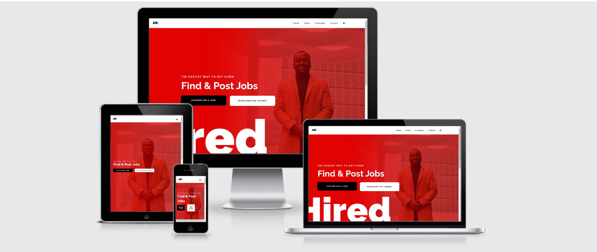
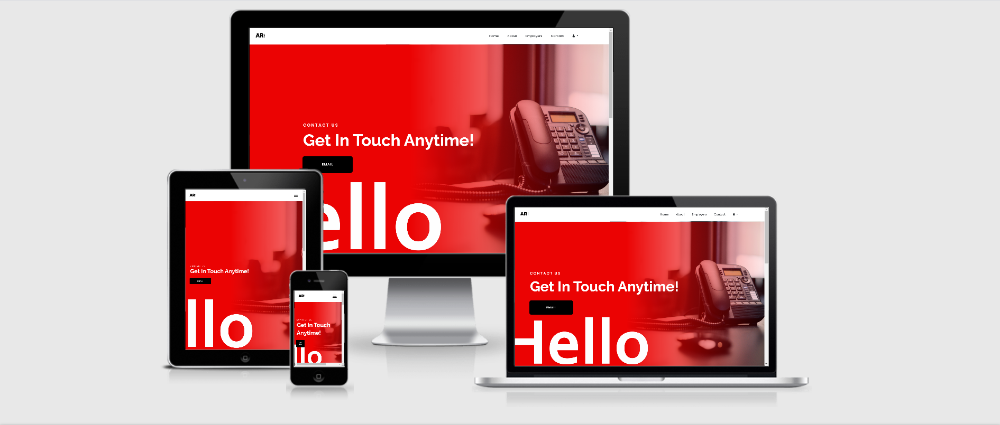
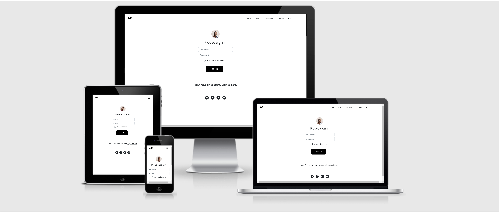
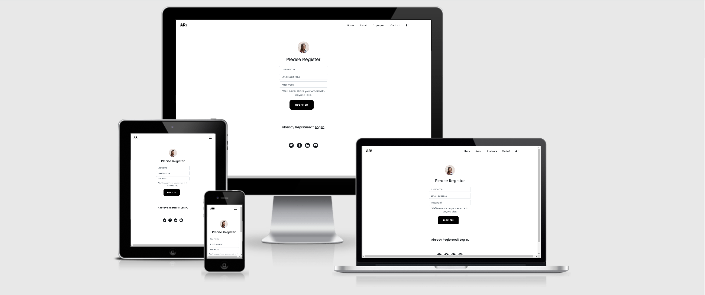
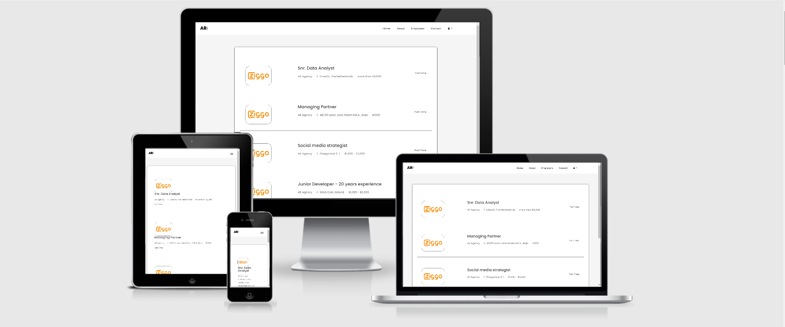
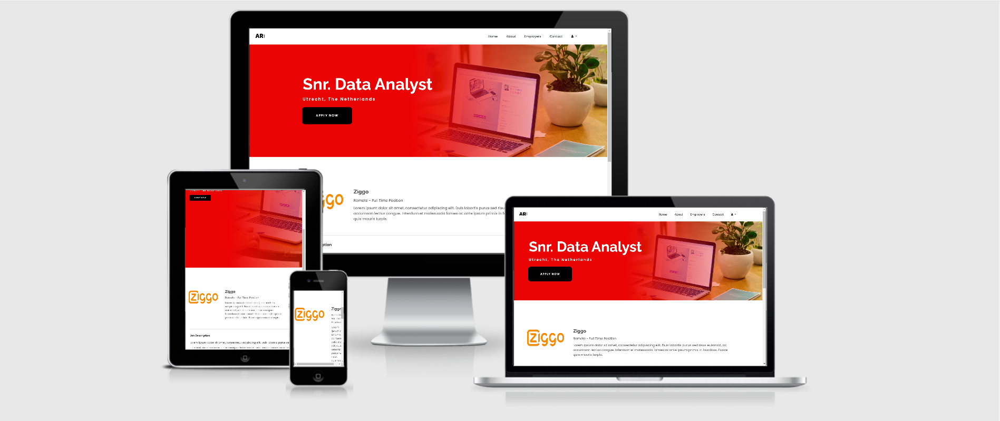

<div align ="center">
    
</div>

## Introduction

<div>
    
</div>

<hr>

[AR Agency](https://ar-recriutment-agency.herokuapp.com/) was created by both Ayo Akinsola and Ruth Dara-Akinsola to help organizations grow by finding the right talents. 
Talents that really match the corporate culture. We believe that this is the basis for a long-term relationship. 
If talents believe in what you believe, it is possible to build a strong brand and achieve structural growth.

## Table of Contents

<!--ts-->

1. [UX](#ux)
    - [Objectives](#objectives)
        - [Visitor Objectives](#visitor-objectives)
        - [Business Objectives](#business-objectives)
        - [AR Agency Objectives](#ar-agency-objectives)
        - [User Stories](#user-stories)
        - [Visitor Stories](#visitor-stories)
        - [Business Stories](#business-stories)
        - [Design Choices](#design-choices)
        - [Wireframes](#wireframes)
        - [PDF](#pdf)

2. [Features](#features)
    - [Existing Features](#existing-features)
        - [Elements on every Page](#elements-on-every-page)
        - [Home Page](#home-page)
        - [About Page](#about-page)
        - [Employers Page](#employers-page)
        - [Contact Page](#contact-page)
        - [Login Page](#login-page)
        - [Sign Up Page](#sign-up-page)
        - [Vacancy Page](#vacancy-page)
        - [Listing Page](#listing-page)
    - [Features Left to Implement](#features-left-to-implement)

3. [Information Architecture](#information-architecture)
    - [Database choice](#database-choice)
    - [Data Storage Types](#data-storage-types)
    - [Database Structure](#database-structure)
    - [Template Style](#template-style)
        

4. [Technologies Used](#technologies-used)

5. [Testing](#testing)
    - [Validation services](#validation-services)
    - [Python Testing](#python-testing)
    - [User Stories Testing](#user-stories-testing)
    - [Visitor Stories](#visitor-stories)
    - [Business Stories](#business-stories)

6. [Deployment](#deployment)
    - [Heroku Deployment](#heroku-deployment)
    - [How to run this project locally](#how-to-run-this-project-locally)

7. [Credits](#credits)
    - [Content](#content)
    - [Media](#media)
    - [Code](#code)
    - [Acknowledgements](#acknowledgements)

8. [Contact](#contact)

9. [Disclaimer](#disclaimer)
    <!--te-->


# UX

## Objectives

### Visitor Objectives

The central target audience for AR Agency are:
- Stdents looking for a student jobs.
- Dutch/English speaking candidates.
- High Skilled Migrants.
- Graduates.

User Objectives are:

- Job seekers have a place to search for jobs in the Netherlands, that offers its listings in both Dutch & English.

- Employers can have access to best candidates. 

- Saves time of both Employers and prospective candidates.

- Job seekers would be helped through the application process. 

- Candidates can be sure they have access to more opportunities.

- Users can have their data stored so they can be contacted for jobs at anytime. 

AR Agency is a great way to meet user needs because:

- AR recruitment agency has access to the best talent available.

- AR recruitment agency saves time because they take care of the initial steps in the hiring process. 

- AR Recruitment agency conducts background checks on candidates, which is essential when considering potential employees.

### Business Objectives 

- Searching for specialised & executive roles.

- Fulfil both short & long term needs.

- Provide a pipeline full of talent to make business decisions.

- Recruiting agencies are partners, not foes.

Business User objectives are:

- A well thought-out, well designed, user-friendly platform that will benefit sell the core function of AR Agency.

- A user interface that is user friendly manage data easily, efficiently & effectively.

- Value creation. Having an online presence to market AR Agency properly.

### AR Agency Objectives

- Provide access to key strategic skills

- AR recruitment agency can speed up the time it takes to find a new employee

- Offer specialist knowledge by telling you what the job market currently looks like and also also let you know how to best achieve your recruitment needs.

- The data management structure has been put in place to manage data and make sure what is provided fits the needs of the database structure.

- The listing page can only be edited by logged in users who post a job. 

- The listing page for the business user shows all their existing listings and gives them the option to view, edit or delete them from this location. 

- THe site offers the business user links and buttons to make navigation easy. 

## User Stories

### Visitor Stories

As a visitor to AR Agency I expect/want/need:

1.  I would like the app to be easy to use.

2.  I would like to easily find what I am looking for, I want the layout of the site to make sense so I am not confused or put off using it. 

3.  Be able to register to have my own profile.

4.  I would like to be able to delete my job posting and all content added by me at any point.

5.  I would like to be able to edit my job posting and all content added by me at any point.

6.  As a user of AR Agency, I expect to be able to easily get in contact via a contact form.

7.  I would like to post the books that I own and want to buy on a online database

8.  As a user accessing this site from a mobile phone or tablet, I want the site to have been designed responsively so that it is still easy to navigate and use on my smaller devices. 

9.  As a user, I would like to view the books that I have added.

10. Be able to browse and navigate information easily.

### Business Stories

1. To be able to log in to access my existing vacancies, and for my data to only be editable with my account.

2. To create, edit and delete vacancies in my account.

3. Forms for inputting my data to make the process easy, that there is no wasting my time or making the process difficult or slow. 

## Design Choices

The AR Agency has an overall professional feel, with emphasis on appealing to both visitors and business users. The following design choices were made with this in mind:

### Fonts

- The primary font `Poppins` was chosen because geometric shape of the letter form is near equal in terms of height and the spacing between characters is perfect. It looks great as a heading font and as body text.

- The secondary font `Raleway` was chosen the appearance is sharp and functional. Raleway brings an elegant, yet bold presence to any website.

### Icons

- Social media icons for facebook, instagram and twitter are used only in the footer on the site. 

### Template Style

I opted for the [Bootstrap 4](https://getbootstrap.com// "Bootstrap Official Site") framework. 
As a tool, Bootstrap 4 is excellent to get started,it offers improved grid system with a new tier that allows you to target mobile users better than ever before. Additionally, semantic mixins have undergone the major update as well.


## Wireframes

The wireframe was created using [Figma](https://www.figma.com/) during the conceptul phase and project proposal to my mentor. 

You can find the wireframe [here](https://1drv.ms/b/s!AqARRU4jO5elunG2T1AiA9FteWuU?e=YpZqiG).

## PDF
- [AR Agency Database Schema]()

This document was created during the planning phase of this project. The final website has some slight differences from what was planned. 
But I included this document in the project to provide insight into the original planning and direction of the site during the planning stages.  

[**To top**](#table-of-contents)


# Features
 
## Existing Features

### Elements on every page
- Navbar
    - The navigation bar features the AR Receuitment logo in the top left corner.

    - For visitors to the site, list items links are available for them to use.
        1. Home
        2. About
        3. Employers
        4. Contact
        5. User icon(this is a dropdown menu)
            - Log in
            - Sign up

    - For users who are logged in, the list items are as follows: 
        1. Home
        2. About
        3. Employers
        4. Contact
        5. User icon(this is a dropdown menu)
            - Log out

    - Python determines if the user is logged in or not by checking `if 'user' in session` and passes this data to Jinja to display the correct navbar for the user.

    - The navbar is collapsed into a hamburger icon on mobile view.

- Footer
    - The footer features:
        - Links to social media locations (which are facebook, twitter, linkedin and youtube ).

### Home Page
<div align="center">

</div>

- The AR home page features a colorful image of myself. I had earlier chosen a different picture but my wife convinced me to go ahead with this.. 
I chose this image because it is eye catching and striking, and it shows that AR Agency is ready for business.  
This image was coded as a background-image in css and set to `background-size: cover;` so that it is responsive while never getting stretched or distorted. 

### About Page

<div align="center">

</div>

- The AR about page features a colorful image. 
This image was coded as a background-image in css and set to `background-size: cover;` so that it is responsive while never getting stretched or distorted. 
Also, there are 8 companies which we currently have in our portfolio
    - Wire
    - Real Wave
    - Inner 
    - Gabo
    - Crosswill
    - Pitch
    - Job line
    - Loud Nick

### Employers Page

<div align="center">

</div>

- The AR employers page features a colorful background image. 
This image was coded as a background-image in css and set to `background-size: cover;` so that it is responsive while never getting stretched or distorted. 
Also, there is a `post a job` button that links to a form for employers to post a vacancy. 
Finally, there are 8 companies which we currently have in our portfolio
    - Wire
    - Real Wave
    - Inner 
    - Gabo
    - Crosswill
    - Pitch
    - Job line
    - Loud Nick

- Finally there are 6 reasons why you should work with AR Agency

    - Fast Hiring Process
    - Low Fees
    - Large Talent Pool
    - Local & Remote
    - 20 years experience
    - Custom Consulting

### Contact Page

<div align="center">

</div>

- The AR contact page features a colorful background image. 
This image was coded as a background-image in css and set to `background-size: cover;` so that it is responsive while never getting stretched or distorted. 
Also, there is a `Email` button that scroll down to the contact form. 
When the contact form is filled a message is flashed to show that form has been filled andthe details are saved in mongodb.

### Login Page

<div align="center">

</div>

- The AR login page features no background image.
- The log in page features a simple **form** where the user can enter their username and their password.
- If the user inputs incorrect data a message is flashed `ìnvalid username/password`. 
- When the form is correctly filled a message is flashed to show that form has been filled and the details are saved in mongodb. Thereafter, the user is logged in. 
- While logged-in, the log-in button disappears and the only button that shows is the log-out  button.

### Sign Up Page

<div align="center">

</div>

- The AR sign-up page features no background image.
- The sign up page also features a simple **form** where the user can enter their username, email and their password.
- When the form is filled a message is flashed to show that form has been filled and the details are saved in mongodb. 
Thereafter, the user is redirected to the login page for them to login. 

### Vacancy Page

<div align="center">

</div>

- The AR vacancy page features no background image.
- The vacancies page features a listing of jobs that have been posted by prospective employers.
- When the employers post a job, it gets fetched from mongodb through a for loop and posted automatically to the vacancy page.
- The following gets fetched from mongodb:
    
    - `{{employer.job}}`
    - `{{employer.address}}`
    - `{{employer.salary}}`
    - `{{employer.employment}}`

### Listing Page

<div align="center">

</div>

- The listing page for an entry in the database displays that information in clearly laid out and easy format. Utilizing set out template on listing.html. The following data is fetched from mongo using these templates:
    
    - `{{employer.job}}`
    - `{{employer.address}}`
    - `{{employer.employment}}`

- The **job description** for the listing page are displayed in a way that is easy to read and understand.

- The **responsibilities** for the listing page are displayed in a way that is easy to read and understand.

- The **qualifications** for the listing page are displayed in a way that is easy to read and understand.

The listing page also features 2 buttons `Apply now` & `I'm Interested`. 
Once both buttons are clicked it opens the candidate form where they can submit their vacancies. 

## Features Left to Implement

1. Email authentication

    - Implementation of email authentication of user account before registration is complete.

2. Full text search

    - A search bar at te home page but it is hard to implement given the time required to complete this course.

3. Pagination

    - I did not implement this as it was beyond the scope of this course but it would be useful to implement flask-paginate
      on the vacancies page. 

4. Filter pane.

    - In order to filter by date, employment and type of job.

5. Content
    - I was not bale to add enough content becuase of time. But since this project is going to be eventually deployed, I will add more conted in due time. 

6. Upload Image
    - In future projects, I would like to add a upload a image button to allow the user to upload a images of their companies so that it gets fetched when they post a job.

[**To top**](#table-of-contents)


# Information Architecture

### Database Choice

For this project,  a NoSQL database structure is required. In that regards, Mongodb which is a document based databased is used to store data. 

To have easy access to relational data, inner objects were used inside the data structure so that they could be accessed and looped through where needed.

### Data Storage Types

The types of data stored in MongoDB for this project are:
- ObjectId
- String
- Boolean
- Object

#### Database Structure

```console
contacts: {
_id: 5f214f5d7118fff4378bf9c0
first_name: "string"
last_name: "string"
email: "string"
message:  "string"
}

```

```console
candidates: {
_id: 5f1e4bd7ae7f3a29b7ae72dd
salutation: "string"
first_name: "string"
last_name: "string"
email: "string"
phone:  "integer"
job: "string"
file:  "string"
}

```

```console
employer: {
_id: 5f22a3ecba875592b4abeb14
salutation: "string"
first_name: "string"
last_name: "string"
company_name: "string"
size: "string"
email: "string"
employment: "string"
address: "string"
phone:  "integer"
job: "string"
file:  "string"
}

```

```console
users: {
_id: 5f0fa3f8623dadac19744ad2
password: "string"
name: "string"
}

```
[**To top**](#table-ofcontents)

### Tools
- [Gitpod](https://gitpod.io) is the IDE used for developing this project. 
- [PIP](https://pip.pypa.io/en/stable/installing/) for installation of tools needed in this project.
- [Git](https://gist.github.com/derhuerst/1b15ff4652a867391f03) to handle version control.
- [MongoDB Atlas](https://www.mongodb.com/cloud/atlas) is the database for this project
- [GitHub](https://github.com/) to store and share all project code remotely. 
- [Am I Responsive](http://ami.responsivedesign.is/) to create the images in this readme file of each page displayed on different screen sizes.

### Libraries
- [JQuery](https://jquery.com) to simplify DOM manipulation.
- [Bootstrap](https://www.bootstrapcdn.com/) to simplify the structure of the website and make the website responsive easily.
- [FontAwesome](https://www.bootstrapcdn.com/fontawesome/) to provide icons for AR Agency.
- [Google Fonts](https://fonts.google.com/) to style the website fonts.
- [PyMongo](https://api.mongodb.com/python/current/) to make communication between Python and MongoDB possible.
- [Flask](https://flask.palletsprojects.com/en/1.0.x/) to construct and render pages.
- [Jinja](http://jinja.pocoo.org/docs/2.10/) to simplify displaying data from the backend of this project smoothly and effectively in html.

### Languages
- This project uses HTML, CSS, JavaScript and Python programming languages.

### Other Resources

- [w3schools](https://www.w3schools.com/)
- [Stack Overflow](https://stackoverflow.com/)
- [Slack](https://slack.com/)

[**To top**](#table-of-contents)


# Testing 

### Validation Services
The following validation services and linter were used to check the validity of the website code.

- [W3C Markup Validation]( https://validator.w3.org/) was used to validate HTML.

- [W3C CSS validation](https://jigsaw.w3.org/css-validator/) was used to validate CSS.

- [Python Buddy](https://pythonbuddy.com/) was used to validate Python.

## User Stories Testing

### Visitor Stories

The following section goes through each of the user stories from the UX section of [README.md](README.md)

**As a visitor to FamilyHub I expect/want/need**

1. *To easily find what I am looking for, I want the layout of the site to make sense so I am not confused or put off using it.*

    - The Family Hub navbar is laid out in the conventional way: 

        - Navbar is at the top of the screen.

        - The logo on the far left of the navbar and links to the home page.

        - The primary purpose of the site - the Activities page - is easily found in the navbar.

        - create account, log in links or my account dropdown links are all provided in the navbar where the user would expect to find them.

        - The navbar shows the user appropriate links depending on if they are logged in or out. 

    - The footer is also laid out in a conventional way: 

        - Contact information and links are provided in the footer.

        - A brief introduction to the goals behind the site are featured.

        - Popular links section.

        - Social media links also provided in the footer where the user would expect to find them. 

    - Everything on the site is clearly labeled, with the users journey through the site carefully considered and buttons/links provided where they would need them. 

2. *The information I am presented with to be laid out in a way that is easy for me to navigate and digest, so that I find what I need quickly and efficiently.*

    - On full listing pages, where all the data for the user is displayed: 

        - The page is broken up into easy to understand sections, and the data displayed in a way that is most easy to digest. 

        - Tables and icons are used where applicable, which all aid in easily accessible and digestible information for the user.

3. *The ability to search through small amounts of information to find what I need, and then be able to easily click to get more detailed information when I need it.*

    - On search pages where multiple activities are displayed, only the most important information is provided on cards, in bite size amounts. Clear links on these cards lead the user to more information should they wish to see it. 

4. *To filter the events and activities to find the entries that are best for the age(s) of my child(ren).*

    - The filter navbar on the activities page provides multiple ways to filter results from the activities database collection.

5. *As a user who does not want to travel far for the activity I am looking for, I want to search for activities in my town.*

    - A dropdown menu allows user to filter results by town.'

6. *The site to provide easy access to the contact information, phone number, email, website, social media links, and a google map link for an activity or event I am interested in attending.*

    - All of these are provided in the listing page of each activity.

7. *As a user on a budget, I want to be able to filter results by free entry. I also want to know at which events I am allowed to bring my own food to.*
    - The Activities page provides: 

        - a filter for all database entries that have free entry.

        - A filter for all database entries that allow people to bring their own food.

8. *As a user searching for things to do on a rainy day, I want to be able to filter results for ones suitable for poor weather.*
    - The Activities page provides a filter for all database entries that are suitable for poor weather.

9. *As a parent planning a birthday party, I am looking for ideas on places to hold it. I want to be able to filter results by those that run birthday parties.*
    - The Activities page provides a filter for all database entries that host birthday parties.

10. *As a parent looking for something to do on a certain day of the week, I want to be able to filter results for which days of the week they are open.*
    - The Activities page provides filters to search for activities open on a certain day of the week, on a weekday or at the weekend.

11. *As a user accessing this site from a mobile phone or tablet, I want the site to have been designed responsively so that it is still easy to navigate and use on my smaller devices. *
    - Family Hub was carefully planned and designed to be responsive and work well on mobile, tablet and desktop devices. 

12. *As a parent searching for ideas for things for my child(ren) to do, I want to be able to filter activities by categories they are interested in.* 
    - The Activities page provides a dropdown menu to choose from a range of categories and interests.

13. *As a regular user of the Family Hub website, I expect to be able to connect to their social media channels, to keep up to date with new entries on the site.* 
    - Social media links are provided on the footer of every page.

14. *As a user of Family Hub, I expect to be able to easily get in contact via a contact form.*
    - An email contact form can be found on the contact page, a link to which is in the navbar and footer on every page.

15. *As a user I expect feedback from the website I am using when I interact with it, I expect loading spinners when pages are taking a while to load, I expect pop ups and modals to inform me when my forms have been completed and sent correctly.*

    - Loading spinner runs on each page as it is loading, and also shows when the database is being accessed via `fetch` to display data on the screen.

    - Information modals are provided for every step of the site that they are needed on, which give the user feedback for correct and incorrect input or if there is an unexpected error. 

### Business Stories

**As a Business user on FamilyHub I expect/want/need**

1. *To see that the information other businesses have put on the site are being displayed in an attractive and useful way for the user.* 
    - The home page, activities page and listing pages are all attractive and easy to navigate and understand.

2. *To see that various methods of contacting my business are available to users using Family Hub.*
    - Family Hub makes it possible for businesses to enter all of the following links to their own contacts:
        - Website url
        - Email form
        - Phone number
        - Facebook url
        - Instagram url
        - Twitter url
        - Address

3. *To be able to log in to access my existing entries, and for my data to only be editable with my account.*
    - Business users can create an account and only have access to edit and delete the listings they created when logged in. 
    - When returning to the site and logging in again all their activities are saved and accessible in their account page.

4. *To create, edit and delete entries in my account.*
    - Business users have easy access to The "Add New" and "Edit" pages, and the delete button is easily accessible on the account page too. 

5. *A user interface that is simple and easy to use, that is laid out in a logical way with clear indications where necessary about the type and format of the data I need to provide.* 
    - The "Add New" and "Edit" pages have a clearly laid out and easy to understand structure to them, with alerts and messages that pop up when incorrect data has been entered. 

6. *Forms for inputting my data to make the process easy, that there is no wasting my time or making the process difficult or slow.* 
    - Though the data input for an activity is large, it is arranged in learnable small chunks that walk the user through the steps clearly. 

7. *Protections have been put in place to prevent me from accidentally deleting an activity listing.*
    - When a business user clicks the "Delete" button for one of their listings in their account page, a modal pops up asking them to confirm they want to delete this listing by typing "DELETE" into the input field. Only when the input field's value is equal to `DELETE` will the confirm delete button become clickable. Once this is clicked the request will be sent to do the database to delete that entry.
    
## Manual Testing
Below is a detailed account of all the manual testing that has been done to confirm all areas of the site work as expected. 

### Testing undertaken on desktop

All steps on desktop were repeated in browsers: Firefox, Chrome and Internet Explorer and on two different desktop screen sizes.

#### Elements on every page

1. Navbar 
    - Hover over each link, confirm the hover effect works as expected. 
    - Click the **Family Hub logo**, confirm it takes the user to the home page.
    - Click the **Home** link, confirm it takes the user to the home page.
    - Click the **Activities** link, confirm it takes the user to the activities page.
    - Click the **Contact** link, confirm it takes the user to the contact page.
    - Click the **Create Account** link, confirm it takes the user to the create account page.
    - Click the **Log In** link, confirm it takes the user to the log in page.
    - Log into Family hub, confirm that the navbar no longer displays the **Create Account** or **Log In** links but does now display the **My Account** dropdown menu.
    - Click the **My Listings** link, confirm it takes the user to their account page.
    - Click the **Add New** link, confirm it takes the user to the create new listing page.
    - Click the **Settings** link, confirm it takes the user to their account settings page.
    - Click the **Log out** link, confirm the user is logged out and the navbar returns to the logged out configuration.

2. Footer
    - Hover over each link, confirm the hover effect works as expected. 
    - Click the **address link**, confirm this opens a google maps link to the address in a new tab.
    - Click the **email link**, confirm this takes the user to the contact page.
    - Click the **Search Activities link**, confirm it takes the user to the activities page. 
    - Click the **Privacy Policy link**, confirm it takes the user to the privacy policy page.
    - Click the **Create an Account link**, confirm it takes the user to the add new account page.
    - Click the **Log in link**, confirm it takes the user to the log in page.
    - Click the **Facebook**, **Instagram** and **Twitter icons** and confirm they open the relevant social media pages in separate browser tabs.

3. Loading Spinner
    - Open any page and confirm that the **loading spinner** displays for 2 seconds as the page content is loaded.
    - Confirm the spinner animates as expected.

4. Floating to-top button
    - Confirm that the **to-top button** is not visible when user is at the top of the page. 
    - Scroll the page down, confirm that the button is gently animated opacity increases.
    - Confirm that as the user scrolls the button remains in the same place on the screen. 
    - Click the button, confirm the user is taken smoothly back up to the top of the page. 
    - Confirm that when back up at the top of the page, the button animates back to invisible. 

#### Home Page

1. Hero Image
    - Confirm that hero image loads at a reasonable speed, and that the image is sharp and clear. 
    - Confirm the heading for the page is easy to read.

2. Event Cards
    - View the event cards and confirm that they are all the same size.
    - Confirm the card images are loading. 
    - Confirm that the town they are based in is overlaid at the bottom right of the image.
    - Confirm the activity title is correct and displaying correctly.
    - Confirm the shadow effect on the card increases when the card is hovered over. 
    - Click in various places on the cards, confirm that the entire card is clickable to take the user to the listing page. 
    - Confirm that the link to the activities full listing page takes the user to the correct page.
    
3. Carousels
    - View the carousels and confirm that they slide a comfortable speed and interval. 
    - Hover over a carousel card, confirm that the carousel stops moving while hovered. 
    - Move mouse away from carousel, confirm that carousel starts moving again.
    - Click the carousel slide indicators below the carousels, confirm that the carousels move to match the slide selected.
    - Reload the page and confirm that the cards displayed have been randomized, and that that other listings are being shown that were not before.

4. Top Tip Feature box
    - View the Top Tip Feature box, confirm that it displays the featured activity title and first 2 paragraphs of its description correctly.
    - Hover over the box, confirm that the box-shadow hover effect increases when the box is hovered over.
    - Click the Read More link confirm it takes the user to the listing for this activity.

5. Search More buttons
    - Click each of the "Search More" buttons on the home page, confirm that they all take the user to the activities page.

#### Activities Page

- When the activities page is loaded, check what number of results displayed at the top of the page. 
- Log in and go to my account page, choose to edit one of my activities, click "preview" - which sets `{ "published": false }` on that listing, and to _not_ click to publish it on the next page. 
- Return to the activities page, confirm that the number of results displayed has dropped by one, and the activity I edited is no longer in the results show on the activities page. 
- Go back to my edited listing and publish it, confirm that this change is reflected on the activities page again.

1. Activity Cards
    - The same html code is imported using Jinja to construct these cards as is used on the home page, so testing for these is already complete. 

2. Filters
    - Click the location dropdown menu, select a town, confirm that all listings loaded are in the town selected. Repeat this action for other towns in the list.
    - Click the category dropdown menu, select a town, confirm that the listings loaded have this category selected. Repeat this action for other categries in the list.
    - Repeat this action for all the filters in the filters side navigation. 
    - Combine several filters at the same time, confirm that the results given match the filters selected. 
    - Repeat several more times with different filters. 
    - Click the "clear filters" button and confirm that it does indeed clear all filters selected.
    - Scroll page downwards, confirm that filters remain fixed to the side of the page.

3. Pagination
    - Scroll to the bottom of the page and confirm that pagination has been loaded when there are more than 12 results. 
    - Click each page in turn, confirm that the pages change and in the right order. 
    - Click the previous and next buttons in pagination, confirm that they do load the correct pages results. 
    - Filter results so there are less than 13 results, confirm that the pagination is not loaded in this case. 
    - Filter results to load around 26 listings, confirm that pagination creates 3 pages (12 listings per page).


#### Listing Page
1. Url

    - Check url for the listing page, confirm that the url includes the title of the activity, but that it has formatted as a slug. For example if the listing title is **Jungle in the library!**, the url is `https://family-hub-nl.herokuapp.com/listing/jungle-in-the-library`

2. Listing details

    - Confirm that the **title** is displaying correctly.

    - Confirm that the **listing image** has loaded correctly, and is styled with box shadow and curved corners.

    - Confirm that the **opening times** displayed are correct, and that the table is laid out in an easy to read manner. 

    - Confirm that the **dates** section of the page **is visible** for a listing that has a start and end date. And that the dates are displayed correctly (Day/Month?Year)

    - Confirm that the dates section of the page is **not visible** for a listing that has selected "ongoing" rather than start and end dates.

    - Confirm that the **ages list** is displaying as desired, that the green check marks and red crosses display on the correct selections for age range for the listing.

    - Confirm that the **address** the business user has input is displayed correctly, and that it links to the correct google maps page for that address, with a link that opens in a separate tab. 

    - Check that the **categories** displayed on the listing page correspond with the ones selected when it was created. 

    - Confirm that the correct **icons** for each categories are displaying on this page as well. 

    - In the **More Info** section, confirm that the selections chosen are displaying and that the icons with them are the relevant ones. 

    - Check that the **description** section is displaying the text supplied correctly, and that new paragraphs are started as expected. 

    - Click the **share icons** at the bottom of the page, confirm that they each in turn launch pages where the user can either post a link to the page on facebook, twitter or send the link to a friend as an email. 

    - Click the **Search More Activities** button, confirm that it takes the user back to the Activities page.

    - Confirm that the **contact links** provided on the listing page are correct. 

        - That the url to the activities **website** opens in tha new tab and leads to the correct website. 

        - That the **telephone** button when clicked will launch an application to make a phone call to that number.

        - That the **Email Organisers button** launches the email business modal

    - Email business form:

        - Confirm that the **email business modal** is launched with the business's email address in the top input field, and that this field is deactivated so the email address cannot be changed. 

        - Confirm that trying to send the form without filling out any fields causes the form to prompt the user to fill out the fields. 

        - Confirm that all fields are **required** and the form will not send without everything being filled in. 

        - Confirm that after completing the email form and submitting it that the **email sent modal** is launched. 

        - Break the email code so that the form will not send, confirm that the user is given a **error message modal** to inform them there was a problem. (fixed the code afterwards!)

        - Open an activity I created that was set up to my own email address, confirm that on sending the form I receive the email laid out as expected.

<div align="center">

</div>

#### Create Account Page

- Go to create account page, confirm the the form is displayed correctly. 

- Try to create a new account that already exists (same email and username), confirm that the *alert modal* is launched informing the user that this **account already exists**, with a button to log in provided in it.

- Try to create a new account with a new email address but a username that already exists in the database, confirm that the alert modal informing the user that this **username is already in use**. 

- Try to create a new account with a new username but a email address that already exists in the database, confirm that the alert modal informing the user that this **email is already registered** with Family Hub pops up.

- Create a new account with new username and email address, confirm that the **account conformation modal** is launched with a log in button provided. 

- Click the log in button, confirm that it takes the user to the log in page.

#### log In Page

- Go to the log in page, confirm that the log in form is displayed correctly.

- Try to log in with a username that do not exist in the database, confirm that the alert modal is launched to inform the user that **no account with this username or email address** is registered to FamilyHub.

- Repeat above with incorrect email address, confirm same reaction.

- Try to log in with an existing username but incorrect password, confirm that the alert modal is launched with a message informing the user of **incorrect password** input.

- Try to **log in** using correct **username and password**, confirm that this is successful. 

- Log out, then try to log in using correct **email and password**, confirm that this is successful. 

- Log out, then log in with correct details, confirm that the logged in conformation modal is launched, click both buttons provided on the modal to check that its **links** to the users account page and to create a new listing work as expected.

- Attempt to go to the log in page url when already logged in, confirm that this redirects the user to their account page. 

#### Log Out Feature

- When logged in, click the log out link, confirm that the user is no longer logged in by checking that no session data can be seen in developer tools. 

#### Account Settings Page

- Go to the settings page for the account I am logged in as, confirm that the forms on this page are displaying correctly. 

- Try to change the email address by inputting an incorrect email into the Current Email input form, Confirm that the error modal is launched with a message "Current email is incorrect."

- Try to change the email address by inputting the same email into both fields, Confirm that the error modal is launched with a message "These emails are the same."

- Change the email address registered by inputting the correct old email and a new ones. Confirm that the success alert modal is launched to inform the user that the email has been successfully changed. 

- Log out and back in with the new email address to confirm that it works. 

- Repeat the steps above to check that the Change password form works in the same way.

#### Account Page

- Open My Account page from the account that I used to create most of the listings on the Family Hub website, confirm that cards for each listing are displayed on the page.

- Click the cog icon at the top right of the page, confirm it takes the user to the settings page.

- Click the green Add New button, confirm it takes the user to the add new listing page.

- Confirm that each listing card has a view, edit and delete button underneath it.

- Click a view button, confirm that it takes the user to the listing page for that activity on the Family Hub website.

- Click an edit button, confirm this takes the user to the edit page for this listing.

- Click the delete button, confirm that this launches the confirm delete modal.

- Try to click the confirm delete button without filling in anything in the required DELETE input field, confirm that the button does not allow any click events.

- Fill in the DELETE input field with incorrect input, confirm that the confirm delete button remains unclickable. 

- Fill in the DELETE input field with the "DELETE", confirm that the button is now active and can be clicked. 

- Click the confirm delete button, confirm that the selected listing is deleted from the database.

#### Add New Listing Page

- Open add new listing page, confirm it is laid out the way expected.

- Try to preview a page with no input filled in, confirm that the browser alerts the user to all the input fields that are required. 

- Try to enter a long string into the title input field, confirm that I cannot enter more than 50 characters in this field.

- Try to enter a long sting into the address line 1 field, confirm that I cannot enter more than 50 characters in this field.

- Try to enter a long non-postcode string into the postcode input field, confirm that I am limited to 7 characters in this field.

- Try to enter a string of letters in the phone number field, confirm that the form alerts me to enter a number.

- Try to enter a non-email address string into the email address input field, confirm that the form alerts me to enter a valid email.

- Try to enter a non-url string into all the url fields (website, facebook, twitter, instagram, listing image), confirm that the form alerts me to input valid urls.

- In the dates and times section confirm that the time fields are deactivated and cannot be clicked. 

- Click a switch for a day, confirm that the fields for this days start and end times become active. 

- Try to send the form with a day selected but no corresponding start and end times, confirm that the form responds by telling me to fill out these fields. 

- Confirm that though the fields are active, I cannot input times manually and must use the time pickers provided. 

- Enter a finish time that is before the start time, confirm that an alert modal is launched to tell me about my error, and that the end time field value is removed. 

- Enter a finish time that is the same as the start time, confirm that an alert modal is launched to tell me about my error, and that the end time field value is removed. 

- In the dates section, input a finish date that is before the start date, confirm that an alert modal is launched to tell me about my error, and that the end date field value is removed.

- Click the "ongoing" switch underneath the start and end dates fields, confirm that doing so deactivates these fields and removes any values within them. 

- Click the ongoing switch again to confirm this reactivates the start and end date fields.

- Confirm that the form will not send without at least one checkbox from the category, age range and indoor/outdoor have been selected. 

- Click the link to ImgBB, confirm it takes the user to the image loading site in a new browser tab. 

- Paste a massive amount of text in the description field, confirm that the number or characters is limited to 2000

- Attempt to reload the page page before completing the form, confirm that an alert message is launched warning the user that leaving the page will mean their data is not saved.

- Attempt to go to another page before completing the form, confirm the same alert is launched.

- Enter correct data for a listing, confirm that the preview button takes the user to the preview listing page. 

#### Preview Listing Page

- Open the preview listing page, confirm that the preview bar is visible warning the user that they are in preview mode and their listing is not published yet. 

- Confirm that all the data input that is displayed on the listing page as it should be. 

- Click the "share page" buttons, confirm that the modal informing the user that they cannot share a preview page works as expected. 

- Click the edit button, confirm this takes the user to the edit listing page. 

- Click the publish button, confirm this takes the user to the new listing page for this activity, and that the "new listing has been published" message is visible at the top of this new page. 

- Go to the activities page and confirm that this new listing is now visible in the results, and that the filters relevant to it work as expected.

#### Edit Listing Page

- Open the edit listing page to edit an existing listing, confirm that all the data is displayed as expected in the input, select, checkbox and textarea fields.

- Remove input from a required field, then try to preview the listing, confirm that the form tells me I have an empty required field.

- Make changes to the listing, click preview, confirm that these changes can be seen in the preview page. Click publish, confirm that these changes are also seen on the activities page listings. 

- Attempt to go to another page after making changes to the for but before clicking the publish button, confirm the alert message is launched warning the user that leaving the page will mean their data is not saved.

#### Contact Page

- Open the contact page, confirm that it is laid out the way expected. 

- Try to send the contact form without any input in it, confirm that the form tells the user to fill in the required fields. 

- Enter a non-email address into the email input field and try to send it, confirm the form tells the user to enter a valid email. 

- Fill in all the form correctly and hit send, confirm that the email sent modal is launched to inform the user that the email was successfully sent. 

- Confirm that the forms values are removed on successful sending of email.

- Confirm that the email is received in my email box formatted the way I expect.

- Click the address link, confirm this opens the google maps link to this address in a separate tab. 

- Click the email link, confirm this takes the user to the contact page. 

#### Privacy and Cookies Policy Page

- Open the privacy and cookies policy page, confirm that the sections and headings are laid out the way I expect. 

- Click the links in the policy page, confirm that they each open to the right link and in a separate browser tab. 

#### 404 Page

- Type an incorrect url into the browser, confirm that the user is taken to the custom 404 page. 
- Confirm that the animation on this page is working correctly.
- Click the home button on this page, confirm that it takes the user back to the home page.
- Click the activities button on this page, confirm that it takes the user to the activities page.

#### Permission Denied Page

- When logged out, try to enter a url for a page you need to be logged in to access, confirm this takes the user to the custom permission denied page.
- Click the log in button, confirm this takes the user to the log in page. 
- Click the Go Back button, confirm this takes the user back one step in their browser history.

### Testing undertaken on tablet and phone devices
All steps below were repeated to test mobile and tablet specific elements on my Samsung phone and tablet, in both the firefox browser and samsung internet browser.

Responsive design waw also tested in the Chrome Developer Tools device simulators on all options and orientations.

#### Elements on every page

1. Navbar 
- Open the website on mobile, confirm that the navbar is collapsed into a burger icon
- click the burger icon, confirm that the navbar list appears are expected.
- When logged in, confirm that the navbar list appears as expected for someone logged in.
- When on tablet, confirm that the navbar is not collapsed on my larger tablet screen, but is on the smaller tablet. 

2. Footer
- On mobile, confirm that the footer sections stack on top of each other as expected. 
- On tablet, confirm that the footer sections appear as expected.

4. Floating to-top button
- Confirm that the floating to top button appears and behaves the same way on all devices and browsers.

#### Home Page

- When viewing on **mobile**, Confirm that the home page appears as expected, with one listing taking up the full width of carousel slide, and with three slides on each carousel.

- Confirm that the top tip for summer card is the full width of the mobile screen, with no curved edges. That the image for this card is on top with the text part of the card underneath. 

- Confirm that all buttons and links are clickable on the smaller screen. 

- When viewing on **tablet** confirm that the home page appears as expected. With two listings on each carousel slide, and three slides on each carousel. 

- Confirm thay the top tip for summer card is displayed as a card, with curved edges and margin around it. The image on the left side of the card and the text on the right.

#### Activities Page

1. Filters

- When viewing on **mobile**, confirm that the filters side navigation is hidden when the page is loaded. 

- Click the "open filters" button, confirm that the filters side nav animates open as expected. 

- Click the close button on the filters side nav, confirm that the filters animate closed as expected.

- When viewing on **tablet**, confirm that the filters side nav appears fixed on the side of the page. And that it appears nicely in both portrait and landscape view.

- When viewing the activities page on tablet, the navigation bar is smaller to make room for the filters side nav. Confirm that the navigation menu is collapsed into a burger icon on this page only.

3. Pagination

- Confirm that pagination is readable and useable on mobile and tablet size screens.

#### All Other Pages

[**To top**](#table-of-contents)


# Deployment

## How to run this project locally

To run this project on your own IDE follow the instructions below:

Ensure you have the following tools: 
- An IDE such as [Gitpod](https://gitpod.io)

The following **must be installed** on your machine:
- [PIP](https://pip.pypa.io/en/stable/installing/)
- [Python 3](https://www.python.org/downloads/)
- [Git](https://gist.github.com/derhuerst/1b15ff4652a867391f03)
- An account at [MongoDB Atlas](https://www.mongodb.com/cloud/atlas) or MongoDB running locally on your machine. 


### Instructions
1. Save a copy of the github repository located at https://github.com/ayotundeakinsola/third-milestone-project by clicking the "download zip" button at the top of the page and extracting the zip file to your chosen folder. 
If you have Git installed on your system, you can clone the repository with the following command.
```
git clone https://github.com/ayotundeakinsola/third-milestone-project
```

2. If possible open a terminal session in the unzip folder or cd to the correct location.


3. If needed, Upgrade pip locally with
```
pip install --upgrade pip.
```

4. Install all required modules with the command 
```
pip -r requirements.txt.
```

5. In your local IDE create a file called `env.py`.

6. Inside the env.py file, create a SECRET_KEY variable and a MONGO_URI to link to your own database. Please make sure to call your database `recruitment`, with 4 collections called `contacts`, `employer`, `candidates` and `users`. 

7. You can now run the application with the command
```
python3 run.py
```

8. You can visit the website at `http://0.0.0.0:8080/`

## Heroku Deployment

To deploy AR Agency to heroku, take the following steps:

1. Create a `requirements.txt` file using the terminal command `pip freeze > requirements.txt`.

2. Create a `Procfile` with the terminal command `echo web: python app.py > Procfile`.

3. `git add` and `git commit` the new requirements and Procfile and then `git push` the project to GitHub.

3. Create a new app on the [Heroku website](https://dashboard.heroku.com/apps) by clicking the "New" button in your dashboard. Give it a name and set the region to Europe.

4. From the heroku dashboard of your newly created application, click on "Deploy" > "Deployment method" and select GitHub.

5. Confirm the linking of the heroku app to the correct GitHub repository.

6. In the heroku dashboard for the application, click on "Settings" > "Reveal Config Vars".

7. Set the following config vars:

| Key | Value |
 --- | ---
DEBUG | FALSE
IP | 0.0.0.0
MONGO_URI | `mongodb+srv://<username>:<password>@<cluster_name>-qtxun.mongodb.net/<database_name>?retryWrites=true&w=majority`
PORT | 5000
SECRET_KEY | `<your_secret_key>`

- To get you MONGO_URI read the MongoDB Atlas documentation [here](https://docs.atlas.mongodb.com/)

8. In the heroku dashboard, click "Deploy".

9. In the "Manual Deployment" section of this page, made sure the master branch is selected and then click "Deploy Branch".

10. The site is now successfully deployed.

[**To top**](#table-of-contents)

